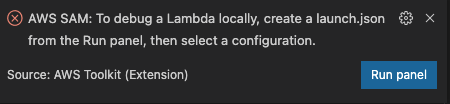

# Hello SAM

- Running `AWS Lambda` locally:

```
𝜆 sam local invoke HelloWorldFunction -e event.json --env-vars environment.json
Invoking index.handler (nodejs12.x)
Skip pulling image and use local one: amazon/aws-sam-cli-emulation-image-nodejs12.x:rapid-1.15.0.

Mounting /Users/terrence/Projects/AWS/hello-sam as /var/task:ro,delegated inside runtime container
START RequestId: 3624be1f-d59b-4d91-92c3-5a93b4b1f46d Version: $LATEST
2021-01-26T23:12:50.909Z	3624be1f-d59b-4d91-92c3-5a93b4b1f46d	INFO	This is Hello World event
END RequestId: 3624be1f-d59b-4d91-92c3-5a93b4b1f46d
REPORT RequestId: 3624be1f-d59b-4d91-92c3-5a93b4b1f46d	Init Duration: 0.53 ms	Duration: 902.44 ms	Billed Duration: 1000 ms	Memory Size: 128 MB	Max Memory Used: 128 MB
{"statusCode":200,"body":"Message sent"}
```

- Running `AWS ApiGateway` locally:

```
𝜆 sam local start-api --env-vars environment.json
Mounting HelloWorldFunction at http://127.0.0.1:3000/ [GET]
You can now browse to the above endpoints to invoke your functions. You do not need to restart/reload SAM CLI while working on your functions, changes will be reflected instantly/automatically. You only need to restart SAM CLI if you update your AWS SAM template
2021-01-27 10:13:59  * Running on http://127.0.0.1:3000/ (Press CTRL+C to quit)
Invoking index.handler (nodejs12.x)
Skip pulling image and use local one: amazon/aws-sam-cli-emulation-image-nodejs12.x:rapid-1.15.0.

Mounting /Users/terrence/Projects/AWS/hello-sam as /var/task:ro,delegated inside runtime container
START RequestId: b38aa7e4-7d36-4dd5-b694-7f92606c0a40 Version: $LATEST
2021-01-26T23:14:08.761Z	b38aa7e4-7d36-4dd5-b694-7f92606c0a40	INFO	This is Hello World event
END RequestId: b38aa7e4-7d36-4dd5-b694-7f92606c0a40
REPORT RequestId: b38aa7e4-7d36-4dd5-b694-7f92606c0a40	Init Duration: 1.56 ms	Duration: 1379.73 ms	Billed Duration: 1400 ms	Memory Size: 128 MB	Max Memory Used: 128 MB
No Content-Type given. Defaulting to 'application/json'.
2021-01-27 10:14:09 127.0.0.1 - - [27/Jan/2021 10:14:09] "GET / HTTP/1.1" 200 -
2021-01-27 10:14:09 127.0.0.1 - - [27/Jan/2021 10:14:09] "GET /favicon.ico HTTP/1.1" 403 -
```

- Running `AWS Lambda` locally for Integration Test:

```
𝜆 sam local start-lambda --env-vars environment.json
Starting the Local Lambda Service. You can now invoke your Lambda Functions defined in your template through the endpoint.
2021-01-27 10:19:09  * Running on http://127.0.0.1:3001/ (Press CTRL+C to quit)
```

In Integration Test, can use AWS client invokes Lambda on http://127.0.0.1:3001 directly.

- Generating sample event payloads, e.g. for Kinesis

```
𝜆 sam local generate-event kinesis --help
Usage: sam local generate-event kinesis [OPTIONS] COMMAND [ARGS]...

Options:
  --help  Show this message and exit.

Commands:
  analytics                  Generates an Amazon Kinesis Data Analytics Event
  analytics-compressed       Generates an Amazon Kinesis Data Analytics Compressed Event

  analytics-dynamodb         Generates an Amazon Kinesis Data Analytics DynamoDB Event

  analytics-kpl              Generates an Amazon Kinesis Data Analytics KPL Event

  apachelog                  Generates an Amazon Kinesis Data Firehose Apachelog Event

  cloudwatch-logs-processor  Generates an Amazon Kinesis Data Firehose Cloudwatch Logs Processor Event

  get-records                Generates an Amazon Kinesis Data Stream Event
  kinesis-firehose           Generates an Amazon Kinesis Data Firehose Event
  streams-as-source          Generates an Amazon Kinesis Data Firehose Streams as Source Event

  syslog                     Generates an Amazon Kinesis Data Firehose Syslog Event
```

```
𝜆 sam local generate-event kinesis kinesis-firehose
{
  "invocationId": "invocationIdExample",
  "deliveryStreamArn": "arn:aws:kinesis:EXAMPLE",
  "region": "us-east-1",
  "records": [
    {
      "recordId": "49546986683135544286507457936321625675700192471156785154",
      "approximateArrivalTimestamp": 1495072949453,
      "data": "SGVsbG8sIHRoaXMgaXMgYSB0ZXN0IDEyMy4="
    }
  ]
}
```

- Running & Debugging in VS Code:

Need to have `AWS Toolkit` extension installed in advance.

In addition, need `package.json` file, for running and debugging locally with all npm modules dependencies.


In VS Code, click `Run` icon on the left bar, then click on `Run and Debug`, to customize `Run and Debug`, and create a launch.json file.

Click on `create a launch.json file`, select the project `hello-sam` in this case, and select `AWS SAM: Debug Lambda Function Locally` in the drop down list, `launch.json` file automatically created under `.vscode/`, same directory along with `template.yaml` file.



Run Lambda function in VS Code, in OUTPUT console:

```
2021-01-27T01:09:14.699Z	14324c65-ade7-4dd3-bcba-c36d609f8af7	INFO	This is Hello World event
END RequestId: 14324c65-ade7-4dd3-bcba-c36d609f8af7
REPORT RequestId: 14324c65-ade7-4dd3-bcba-c36d609f8af7	Init Duration: 3.97 ms	Duration: 2905739.35 ms	Billed Duration: 2905800 ms	Memory Size: 128 MB	Max Memory Used: 128 MB
{"statusCode":200,"body":"Message sent"}Command stopped: "sam local invoke"
Preparing to debug locally: Lambda "index.handler"
Building SAM application...
Running command: (not started) [/usr/local/bin/sam build --build-dir /tmp/aws-toolkit-vscode/vsctkaCiQcQ/output --template /Users/terrence/Projects/AWS/hello-sam/app___vsctk___template.yaml]
Building codeuri: . runtime: nodejs12.x metadata: {} functions: ['HelloWorldFunction']
Running NodejsNpmBuilder:NpmPack
Running NodejsNpmBuilder:CopyNpmrc
Running NodejsNpmBuilder:CopySource
Running NodejsNpmBuilder:NpmInstall
Running NodejsNpmBuilder:CleanUpNpmrc

Build Succeeded

Built Artifacts  : private/tmp/aws-toolkit-vscode/vsctkaCiQcQ/output
Built Template   : private/tmp/aws-toolkit-vscode/vsctkaCiQcQ/output/template.yaml

Commands you can use next
=========================
[*] Invoke Function: sam local invoke -t private/tmp/aws-toolkit-vscode/vsctkaCiQcQ/output/template.yaml
[*] Deploy: sam deploy --guided --template-file private/tmp/aws-toolkit-vscode/vsctkaCiQcQ/output/template.yaml

Build complete.
Starting SAM application locally
Running: (not started) [/usr/local/bin/sam local invoke HelloWorldFunction --template /tmp/aws-toolkit-vscode/vsctkaCiQcQ/output/template.yaml --event /tmp/aws-toolkit-vscode/vsctkaCiQcQ/event.json --env-vars /tmp/aws-toolkit-vscode/vsctkaCiQcQ/env-vars.json -d 5858]
Invoking index.handler (nodejs12.x)
Skip pulling image and use local one: amazon/aws-sam-cli-emulation-image-nodejs12.x:rapid-1.15.0.

Mounting /tmp/aws-toolkit-vscode/vsctkaCiQcQ/output/HelloWorldFunction as /var/task:ro,delegated inside runtime container
START RequestId: 83fcabeb-4a08-498f-8fc9-47a175bc6e0c Version: $LATEST
Debugger listening on ws://0.0.0.0:5858/b05e9e8e-5180-4587-baa8-431677052436
For help, see: https://nodejs.org/en/docs/inspector
Waiting for SAM application to start...
Attaching debugger to SAM application...
Debugger attached.
Debugger attached
2021-01-27T01:12:36.937Z	83fcabeb-4a08-498f-8fc9-47a175bc6e0c	INFO	This is Hello World event
{"statusCode":200,"body":"Message sent"}END RequestId: 83fcabeb-4a08-498f-8fc9-47a175bc6e0c
REPORT RequestId: 83fcabeb-4a08-498f-8fc9-47a175bc6e0c	Init Duration: 1.57 ms	Duration: 16412.32 ms	Billed Duration: 16500 ms	Memory Size: 128 MB	Max Memory Used: 128 MB
Command stopped: "sam local invoke"
```

`AWS SAM` also can bind a localhost port, run & debug Lambda function locally. Check _https://docs.aws.amazon.com/serverless-application-model/latest/developerguide/serverless-sam-cli-using-debugging-nodejs.html_

References
----------

- Creating AWS Lambda with AWS SAM, _https://terrencemiao.github.io/blog/2020/02/14/Creating-AWS-Lambda-with-AWS-SAM/_