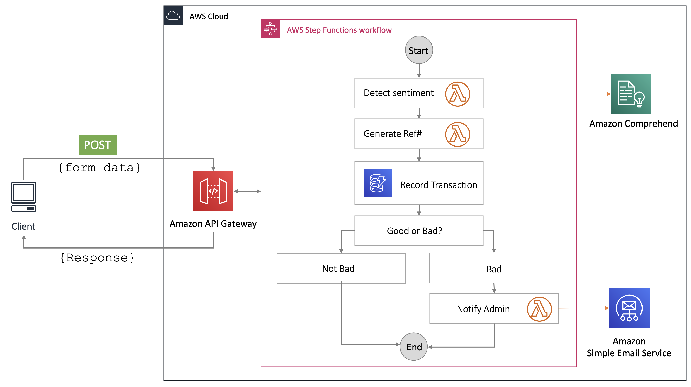

# Contact form processing with Synchronous Express Workflows

This application uses a Synchronous Express workflow to analyse a contact form submission and provide customers with a case reference number.

Read more about Synchronous Express Workflows in this [AWS blog post](https://aws.amazon.com/blogs/compute/new-synchronous-express-workflows-for-aws-step-functions/).



This project contains source code and supporting files for a serverless application that you can deploy with the SAM CLI. It includes the following files and folders:

- functions - Code for the application's Lambda functions.
- statemachines - Definition for the state machine that orchestrates AWS services.
- template.yaml - A template that defines the application's AWS resources.
- api.yaml - A template that defines the application's HTTP API resource.


AWS Step Functions lets you coordinate multiple AWS services into serverless workflows so you can build and update apps quickly. Using Step Functions, you can design and run workflows that stitch together services, such as AWS Lambda, AWS Fargate, and Amazon SageMaker, into feature-rich applications.

The application uses several AWS resources, including Step Functions Express Workflows, API Gateway, Amazon DynamoDB, Lambda functions, Amazon Comprehend and Amazon Simple Email service. These resources are defined in the `template.yaml` file in this project. You can update the template to add AWS resources through the same deployment process that updates your application code.

If you prefer to use an integrated development environment (IDE) to build and test the Lambda functions within your application, you can use the AWS Toolkit. The AWS Toolkit is an open source plug-in for popular IDEs that uses the SAM CLI to build and deploy serverless applications on AWS. The AWS Toolkit also adds a simplified step-through debugging experience for Lambda function code. See the following links to get started:

* [PyCharm](https://docs.aws.amazon.com/toolkit-for-jetbrains/latest/userguide/welcome.html)
* [IntelliJ](https://docs.aws.amazon.com/toolkit-for-jetbrains/latest/userguide/welcome.html)
* [VS Code](https://docs.aws.amazon.com/toolkit-for-vscode/latest/userguide/welcome.html)
* [Visual Studio](https://docs.aws.amazon.com/toolkit-for-visual-studio/latest/user-guide/welcome.html)

The AWS Toolkit for VS Code includes full support for state machine visualization, enabling you to visualize your state machine in real time as you build. The AWS Toolkit for VS Code includes a language server for Amazon States Language, which lints your state machine definition to highlight common errors, provides auto-complete support, and code snippets for each state, enabling you to build state machines faster.

## Deploy the sample application

The Serverless Application Model Command Line Interface (SAM CLI) is an extension of the AWS CLI that adds functionality for building and testing Lambda applications. It uses Docker to run your functions in an Amazon Linux environment that matches Lambda.

To use the SAM CLI, you need the following tools:

* SAM CLI - [Install the SAM CLI](https://docs.aws.amazon.com/serverless-application-model/latest/developerguide/serverless-sam-cli-install.html)
* Node.js - [Install Node.js 12](https://nodejs.org/en/), including the NPM package management tool.
* Docker - [Install Docker community edition](https://hub.docker.com/search/?type=edition&offering=community)

To build and deploy your application for the first time, run the following in your shell:

```bash
sam build
sam deploy --guided
```

The first command will build the source of your application. The second command will package and deploy your application to AWS, with a series of prompts:

* **Stack Name**: The name of the stack to deploy to CloudFormation. This should be unique to your account and region, and a good starting point would be something matching your project name.
* **AWS Region**: The AWS region you want to deploy your app to.
* **ValidatedEmail**: An admin email that has been validated with SES, this is the email address that the application will notify if it detects negative sentiment,
* **Confirm changes before deploy**: If set to yes, any change sets will be shown to you before execution for manual review. If set to no, the AWS SAM CLI will automatically deploy application changes.
* **Allow SAM CLI IAM role creation**: Many AWS SAM templates, including this example, create AWS IAM roles required for the AWS Lambda function(s) included to access AWS services. By default, these are scoped down to minimum required permissions. To deploy an AWS CloudFormation stack which creates or modified IAM roles, the `CAPABILITY_IAM` value for `capabilities` must be provided. If permission isn't provided through this prompt, to deploy this example you must explicitly pass `--capabilities CAPABILITY_IAM` to the `sam deploy` command.
* **Save arguments to samconfig.toml**: If set to yes, your choices will be saved to a configuration file inside the project, so that in the future you can just re-run `sam deploy` without parameters to deploy changes to your application.

You can find your State Machine ARN in the output values displayed after deployment.

## Use the SAM CLI to build and test locally

Build the Lambda functions in your application with the `sam build --use-container` command.

```bash
𝜆 sam build
```

The SAM CLI installs dependencies defined in `functions/*/package.json`, creates a deployment package, and saves it in the `.aws-sam/build` folder.

## Use the SAM CLI to deploy AWS Cloud

```bash
𝜆 sam deploy
Uploading to sam-synchronous-express-step-functions/5b1ae4f46a622c88c1422e8a90f99923  3273 / 3273.0  (100.00%)

	Deploying with following values
	===============================
	Stack name                   : sam-synchronous-express-step-functions
	Region                       : ap-southeast-2
	Confirm changeset            : True
	Deployment s3 bucket         : aws-sam-cli-managed-default-samclisourcebucket-1qfxu9y982ao
	Capabilities                 : ["CAPABILITY_IAM"]
	Parameter overrides          : {"ValidatedEmail": "terrence.miao@auspost.com.au"}
	Signing Profiles             : {}

Initiating deployment
=====================
Uploading to sam-synchronous-express-step-functions/9c95bdd829707b01e875eb95f78c22aa.template  4606 / 4606.0  (100.00%)

Waiting for changeset to be created..

CloudFormation stack changeset
-------------------------------------------------------------------------------------------------------------------------------------------------------------------------------------------------------------------------------------------------------------------------------------
Operation                                                             LogicalResourceId                                                     ResourceType                                                          Replacement
-------------------------------------------------------------------------------------------------------------------------------------------------------------------------------------------------------------------------------------------------------------------------------------
+ Add                                                                 DetectSentimentRole                                                   AWS::IAM::Role                                                        N/A
+ Add                                                                 DetectSentiment                                                       AWS::Lambda::Function                                                 N/A
+ Add                                                                 FormDataTable                                                         AWS::DynamoDB::Table                                                  N/A
+ Add                                                                 GenerateReferenceNumberRole                                           AWS::IAM::Role                                                        N/A
+ Add                                                                 GenerateReferenceNumber                                               AWS::Lambda::Function                                                 N/A
+ Add                                                                 HttpApiRole                                                           AWS::IAM::Role                                                        N/A
+ Add                                                                 HttpApiforSyncWFApiGatewayDefaultStage                                AWS::ApiGatewayV2::Stage                                              N/A
+ Add                                                                 HttpApiforSyncWF                                                      AWS::ApiGatewayV2::Api                                                N/A
+ Add                                                                 NotifyAdminWithSESRole                                                AWS::IAM::Role                                                        N/A
+ Add                                                                 NotifyAdminWithSES                                                    AWS::Lambda::Function                                                 N/A
+ Add                                                                 ProcessFormStateMachineExpressSyncRole                                AWS::IAM::Role                                                        N/A
+ Add                                                                 ProcessFormStateMachineExpressSync                                    AWS::StepFunctions::StateMachine                                      N/A
-------------------------------------------------------------------------------------------------------------------------------------------------------------------------------------------------------------------------------------------------------------------------------------

Changeset created successfully. arn:aws:cloudformation:ap-southeast-2:755034721059:changeSet/samcli-deploy1610082245/0717a5cf-a8f5-4bfd-bdf5-816c95d07209


Previewing CloudFormation changeset before deployment
======================================================
Deploy this changeset? [y/N]: y

2021-01-08 16:04:50 - Waiting for stack create/update to complete

CloudFormation events from changeset
-------------------------------------------------------------------------------------------------------------------------------------------------------------------------------------------------------------------------------------------------------------------------------------
ResourceStatus                                                        ResourceType                                                          LogicalResourceId                                                     ResourceStatusReason
-------------------------------------------------------------------------------------------------------------------------------------------------------------------------------------------------------------------------------------------------------------------------------------
CREATE_IN_PROGRESS                                                    AWS::IAM::Role                                                        DetectSentimentRole                                                   Resource creation Initiated
CREATE_IN_PROGRESS                                                    AWS::IAM::Role                                                        GenerateReferenceNumberRole                                           -
CREATE_IN_PROGRESS                                                    AWS::IAM::Role                                                        NotifyAdminWithSESRole                                                -
CREATE_IN_PROGRESS                                                    AWS::IAM::Role                                                        DetectSentimentRole                                                   -
CREATE_IN_PROGRESS                                                    AWS::IAM::Role                                                        NotifyAdminWithSESRole                                                Resource creation Initiated
CREATE_IN_PROGRESS                                                    AWS::IAM::Role                                                        GenerateReferenceNumberRole                                           Resource creation Initiated
CREATE_IN_PROGRESS                                                    AWS::DynamoDB::Table                                                  FormDataTable                                                         Resource creation Initiated
CREATE_IN_PROGRESS                                                    AWS::DynamoDB::Table                                                  FormDataTable                                                         -
CREATE_COMPLETE                                                       AWS::IAM::Role                                                        GenerateReferenceNumberRole                                           -
CREATE_COMPLETE                                                       AWS::IAM::Role                                                        DetectSentimentRole                                                   -
CREATE_COMPLETE                                                       AWS::IAM::Role                                                        NotifyAdminWithSESRole                                                -
CREATE_IN_PROGRESS                                                    AWS::Lambda::Function                                                 DetectSentiment                                                       -
CREATE_IN_PROGRESS                                                    AWS::Lambda::Function                                                 GenerateReferenceNumber                                               -
CREATE_COMPLETE                                                       AWS::Lambda::Function                                                 GenerateReferenceNumber                                               -
CREATE_COMPLETE                                                       AWS::Lambda::Function                                                 DetectSentiment                                                       -
CREATE_IN_PROGRESS                                                    AWS::Lambda::Function                                                 DetectSentiment                                                       Resource creation Initiated
CREATE_IN_PROGRESS                                                    AWS::Lambda::Function                                                 GenerateReferenceNumber                                               Resource creation Initiated
CREATE_IN_PROGRESS                                                    AWS::Lambda::Function                                                 NotifyAdminWithSES                                                    -
CREATE_IN_PROGRESS                                                    AWS::Lambda::Function                                                 NotifyAdminWithSES                                                    Resource creation Initiated
CREATE_COMPLETE                                                       AWS::Lambda::Function                                                 NotifyAdminWithSES                                                    -
CREATE_COMPLETE                                                       AWS::DynamoDB::Table                                                  FormDataTable                                                         -
CREATE_IN_PROGRESS                                                    AWS::IAM::Role                                                        ProcessFormStateMachineExpressSyncRole                                -
CREATE_IN_PROGRESS                                                    AWS::IAM::Role                                                        ProcessFormStateMachineExpressSyncRole                                Resource creation Initiated
CREATE_COMPLETE                                                       AWS::IAM::Role                                                        ProcessFormStateMachineExpressSyncRole                                -
CREATE_IN_PROGRESS                                                    AWS::StepFunctions::StateMachine                                      ProcessFormStateMachineExpressSync                                    -
CREATE_COMPLETE                                                       AWS::StepFunctions::StateMachine                                      ProcessFormStateMachineExpressSync                                    -
CREATE_IN_PROGRESS                                                    AWS::StepFunctions::StateMachine                                      ProcessFormStateMachineExpressSync                                    Resource creation Initiated
CREATE_IN_PROGRESS                                                    AWS::IAM::Role                                                        HttpApiRole                                                           -
CREATE_IN_PROGRESS                                                    AWS::IAM::Role                                                        HttpApiRole                                                           Resource creation Initiated
CREATE_COMPLETE                                                       AWS::IAM::Role                                                        HttpApiRole                                                           -
CREATE_IN_PROGRESS                                                    AWS::ApiGatewayV2::Api                                                HttpApiforSyncWF                                                      -
CREATE_COMPLETE                                                       AWS::ApiGatewayV2::Api                                                HttpApiforSyncWF                                                      -
CREATE_IN_PROGRESS                                                    AWS::ApiGatewayV2::Api                                                HttpApiforSyncWF                                                      Resource creation Initiated
CREATE_IN_PROGRESS                                                    AWS::ApiGatewayV2::Stage                                              HttpApiforSyncWFApiGatewayDefaultStage                                -
CREATE_COMPLETE                                                       AWS::ApiGatewayV2::Stage                                              HttpApiforSyncWFApiGatewayDefaultStage                                -
CREATE_IN_PROGRESS                                                    AWS::ApiGatewayV2::Stage                                              HttpApiforSyncWFApiGatewayDefaultStage                                Resource creation Initiated
CREATE_COMPLETE                                                       AWS::CloudFormation::Stack                                            sam-synchronous-express-step-functions                                -
-------------------------------------------------------------------------------------------------------------------------------------------------------------------------------------------------------------------------------------------------------------------------------------

CloudFormation outputs from deployed stack
-------------------------------------------------------------------------------------------------------------------------------------------------------------------------------------------------------------------------------------------------------------------------------------
Outputs
-------------------------------------------------------------------------------------------------------------------------------------------------------------------------------------------------------------------------------------------------------------------------------------
Key                 NotifyAdminWithSES
Description         Lambda Function ARN
Value               arn:aws:lambda:ap-southeast-2:755034721059:function:sam-synchronous-express-step-fu-NotifyAdminWithSES-1S74BCQW5DJYI

Key                 NotifyAdminWithSESIamRole
Description         Implicit IAM Role created for function
Value               arn:aws:iam::755034721059:role/sam-synchronous-express-ste-NotifyAdminWithSESRole-1GIN7OTT3BI8

Key                 HelloWorldApi
Description         Sync WF API endpoint
Value               https://95t91rry59.execute-api.ap-southeast-2.amazonaws.com

Key                 FormDataTable
Description         DynamoDB Table
Value               sam-synchronous-express-step-functions-FormDataTable-1VRY3EBUR3JIZ
-------------------------------------------------------------------------------------------------------------------------------------------------------------------------------------------------------------------------------------------------------------------------------------

Successfully created/updated stack - sam-synchronous-express-step-functions in ap-southeast-2
```

```bash
𝜆 aws stepfunctions start-sync-execution \
      --state-machine-arn arn:aws:states:ap-southeast-2:755034721059:stateMachine:ProcessFormStateMachineExpressSync-sQqNmSfbZbgM \
      --input '{"message" : "This is bad service"}'
{
    "executionArn": "arn:aws:states:ap-southeast-2:755034721059:express:ProcessFormStateMachineExpressSync-sQqNmSfbZbgM:a4172672-d7cd-4dc5-9b16-00313dd30178:277a5fea-5817-4ded-a420-95355dd3e643",
    "stateMachineArn": "arn:aws:states:ap-southeast-2:755034721059:stateMachine:ProcessFormStateMachineExpressSync-sQqNmSfbZbgM",
    "name": "a4172672-d7cd-4dc5-9b16-00313dd30178",
    "startDate": "2021-01-08T12:01:20.573000+11:00",
    "stopDate": "2021-01-08T12:01:24.788000+11:00",
    "status": "SUCCEEDED",
    "input": "{\"message\" : \"This is bad service\"}",
    "inputDetails": {
        "included": true
    },
    "output": "{\"message\":\"This is bad service\",\"SentimentResults\":{\"Sentiment\":\"NEGATIVE\",\"SentimentScore\":{\"Positive\":1.2588832760229707E-4,\"Negative\":0.9994465708732605,\"Neutral\":2.270389668410644E-4,\"Mixed\":2.0044681150466204E-4}},\"ticketId\":\"9cuop7\",\"ddbPutResult\":{\"SdkHttpMetadata\":{\"AllHttpHeaders\":{\"Server\":[\"Server\"],\"Connection\":[\"keep-alive\"],\"x-amzn-RequestId\":[\"d6cdabf8-9e8e-4fab-bf99-b00f4b9b7f7a\"],\"x-amz-crc32\":[\"2745614147\"],\"Content-Length\":[\"2\"],\"Date\":[\"Fri, 08 Jan 2021 01:01:22 GMT\"],\"Content-Type\":[\"application/x-amz-json-1.0\"]},\"HttpHeaders\":{\"Connection\":\"keep-alive\",\"Content-Length\":\"2\",\"Content-Type\":\"application/x-amz-json-1.0\",\"Date\":\"Fri, 08 Jan 2021 01:01:22 GMT\",\"Server\":\"Server\",\"x-amz-crc32\":\"2745614147\",\"x-amzn-RequestId\":\"d6cdabf8-9e8e-4fab-bf99-b00f4b9b7f7a\"},\"HttpStatusCode\":200},\"SdkResponseMetadata\":{\"RequestId\":\"d6cdabf8-9e8e-4fab-bf99-b00f4b9b7f7a\"}},\"SESOutput\":{\"message\":\"Email address is not verified. The following identities failed the check in region AP-SOUTHEAST-2: terrence.miao@auspost.com.au\",\"code\":\"MessageRejected\",\"time\":\"2021-01-08T01:01:24.622Z\",\"requestId\":\"4300f205-55b2-4028-80cf-6b5c53491c23\",\"statusCode\":400,\"retryable\":false,\"retryDelay\":84.21977325595596}}",
    "outputDetails": {
        "included": true
    },
    "traceHeader": "Root=1-5ff7aee0-c88256b35bd291553e782a18;Sampled=1",
    "billingDetails": {
        "billedMemoryUsedInMB": 64,
        "billedDurationInMilliseconds": 4300
    }
}

𝜆 curl --location --request POST 'https://3s5lbhrvxc.execute-api.ap-southeast-2.amazonaws.com' \
       --header 'Content-Type: application/json' \
       --data-raw '{"message":" This is good service"}'
{"billingDetails":{"billedDurationInMilliseconds":900,"billedMemoryUsedInMB":64},"executionArn":"arn:aws:states:ap-southeast-2:755034721059:express:ProcessFormStateMachineExpressSync-sQqNmSfbZbgM:d00edb0d-070a-4f80-abc7-6ea7468ce904:8053e355-23d4-4aac-b907-59d866f2f77e","input":"{\"message\":\" This is good service\"}","inputDetails":{"__type":"com.amazonaws.swf.base.model#CloudWatchEventsExecutionDataDetails","included":true},"name":"d00edb0d-070a-4f80-abc7-6ea7468ce904","output":"{\"message\":\" This is good service\",\"SentimentResults\":{\"Sentiment\":\"POSITIVE\",\"SentimentScore\":{\"Positive\":0.9996684789657593,\"Negative\":4.201925185043365E-5,\"Neutral\":1.6366728232242167E-4,\"Mixed\":1.257952826563269E-4}},\"ticketId\":\"w03mk\",\"ddbPutResult\":{\"SdkHttpMetadata\":{\"AllHttpHeaders\":{\"Server\":[\"Server\"],\"Connection\":[\"keep-alive\"],\"x-amzn-RequestId\":[\"8cc13e2d-78be-47b0-800a-4e094900a966\"],\"x-amz-crc32\":[\"2745614147\"],\"Content-Length\":[\"2\"],\"Date\":[\"Fri, 08 Jan 2021 01:13:13 GMT\"],\"Content-Type\":[\"application/x-amz-json-1.0\"]},\"HttpHeaders\":{\"Connection\":\"keep-alive\",\"Content-Length\":\"2\",\"Content-Type\":\"application/x-amz-json-1.0\",\"Date\":\"Fri, 08 Jan 2021 01:13:13 GMT\",\"Server\":\"Server\",\"x-amz-crc32\":\"2745614147\",\"x-amzn-RequestId\":\"8cc13e2d-78be-47b0-800a-4e094900a966\"},\"HttpStatusCode\":200},\"SdkResponseMetadata\":{\"RequestId\":\"8cc13e2d-78be-47b0-800a-4e094900a966\"}}}","outputDetails":{"__type":"com.amazonaws.swf.base.model#CloudWatchEventsExecutionDataDetails","included":true},"startDate":1.610068392743E9,"stateMachineArn":"arn:aws:states:ap-southeast-2:755034721059:stateMachine:ProcessFormStateMachineExpressSync-sQqNmSfbZbgM","status":"SUCCEEDED","stopDate":1.610068393574E9,"traceHeader":"Root=1-5ff7b1a8-85f06fa4589de340d0167080;Sampled=1"}⏎
```

## Add a resource to your application
The application template uses AWS Serverless Application Model (AWS SAM) to define application resources. AWS SAM is an extension of AWS CloudFormation with a simpler syntax for configuring common serverless application resources such as functions, triggers, and APIs. For resources not included in [the SAM specification](https://github.com/awslabs/serverless-application-model/blob/master/versions/2016-10-31.md), you can use standard [AWS CloudFormation](https://docs.aws.amazon.com/AWSCloudFormation/latest/UserGuide/aws-template-resource-type-ref.html) resource types.

## Fetch, tail, and filter Lambda function logs

To simplify troubleshooting, SAM CLI has a command called `sam logs`. `sam logs` lets you fetch logs generated by your deployed Lambda function from the command line. In addition to printing the logs on the terminal, this command has several nifty features to help you quickly find the bug.

`NOTE`: This command works for all AWS Lambda functions; not just the ones you deploy using SAM.

```bash
sam-sync-express-step-functions$ sam logs -n GenerateReferenceNumber --stack-name sam-sync-express-step-functions --tail
```

You can find more information and examples about filtering Lambda function logs in the [SAM CLI Documentation](https://docs.aws.amazon.com/serverless-application-model/latest/developerguide/serverless-sam-cli-logging.html).


## Cleanup

To delete the sample application that you created, use the AWS CLI. Assuming you used your project name for the stack name, you can run the following:

```bash
aws cloudformation delete-stack --stack-name sam-sync-express-step-functions
```

## Resources

See the [AWS SAM developer guide](https://docs.aws.amazon.com/serverless-application-model/latest/developerguide/what-is-sam.html) for an introduction to SAM specification, the SAM CLI, and serverless application concepts.

Next, you can use AWS Serverless Application Repository to deploy ready to use Apps that go beyond hello world samples and learn how authors developed their applications: [AWS Serverless Application Repository main page](https://aws.amazon.com/serverless/serverlessrepo/)
